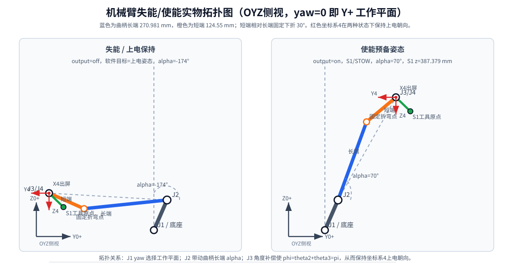
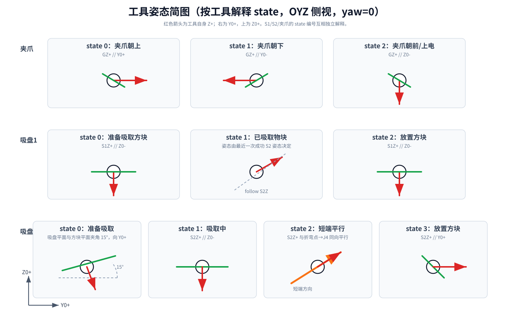

# 可用命令清单

来源：

- `Components/Algorithm/Inc/Data_Analysis.h`
- `Components/Algorithm/Src/Data_Analysis.c`
- `ROBOT_USB_CONTROL_PROTOCOL.md`

## USB 帧格式

```text
A5 5A LEN CMD DATA... CRC_H CRC_L FF
```

- `HEAD1=0xA5`
- `HEAD2=0x5A`
- `TAIL=0xFF`
- CRC：CRC16/Modbus，初值 `0xFFFF`，多项式 `0xA001`
- CRC 计算范围：`HEAD1 HEAD2 LEN CMD DATA`
- CRC 发送顺序：高字节在前，低字节在后
- 带参数命令使用 `LEN=0x10`，`DATA=<4 个 float32 little-endian>`
- 无参数、停止、状态查询命令推荐使用 `LEN=0x00`

## System

| CMD | 名称 | DATA | 作用 |
|---:|---|---|---|
| `0x00` | `SYS_DISABLE` | 空或 4float | 停止 yaw 调参、USB 底盘、上/下台阶；机械臂输出失能并回上电零位软件目标；清除底盘使能标志 |
| `0x01` | `SYS_ENABLE` | 空或 4float | 打开 USB 底盘使能标志并使能机械臂；机械臂 J1/J2 回固定准备姿态，J3 抱死上电电机零位；不会自动打开吸盘/夹爪或台阶状态机 |
| `0x02` | `SYS_SWITCH_SOURCE` | `f0=0/1` | 切换控制源，`0=USART`，`1=USB` |
| `0x05` | `SYS_STOP` | 空或 4float | 停止 yaw 调参、USB 底盘和上/下台阶；机械臂保持当前位置并停止输出 |
| `0x06` | `SYS_GET_STATUS` | 空或 4float | 查询系统状态 |

```text
SYS_DISABLE              A5 5A 00 00 FB 02 FF
SYS_ENABLE               A5 5A 00 01 3B C3 FF
SYS_STOP                 A5 5A 00 05 F8 C2 FF
SYS_GET_STATUS           A5 5A 00 06 F9 82 FF
SYS_SWITCH_SOURCE USB    A5 5A 10 02 00 00 80 3F 00 00 00 00 00 00 00 00 00 00 00 00 38 4B FF
SYS_SWITCH_SOURCE USART  A5 5A 10 02 00 00 00 00 00 00 00 00 00 00 00 00 00 00 00 00 87 9F FF
```

## Chassis 底盘

| CMD | 名称 | DATA | 作用 |
|---:|---|---|---|
| `0x10` | `CHS_DISABLE` | 空或 4float | 底盘失能并停止 USB 底盘控制器 |
| `0x11` | `CHS_ENABLE` | 空或 4float | 底盘使能 |
| `0x12` | `CHS_SET_MODE` | `f0=mode` | 设置底盘模式 `0..7` |
| `0x13` | `CHS_SET_VEL` | `f0=vx, f1=vy, f2=yaw_data, f3=0` | 设置速度目标 |
| `0x14` | `CHS_SET_POS` | `f0=dx, f1=dy, f2=yaw_data, f3=0` | 设置一次位置位移目标 |
| `0x15` | `CHS_STOP` | 空或 4float | 停止 USB 底盘控制器 |
| `0x16` | `CHS_GET_STATUS` | 空或 4float | 查询底盘状态 |

底盘模式：

| mode | 名称 | 坐标系 | 控制方式 | yaw |
|---:|---|---|---|---|
| `0` | `ROBOT_NO_YAW_VEL` | 机器人系 | 速度 | 锁 yaw |
| `1` | `ROBOT_VEL` | 机器人系 | 速度 | 可转向 |
| `2` | `WORLD_NO_YAW_VEL` | 世界系 | 速度 | 锁 yaw |
| `3` | `WORLD_VEL` | 世界系 | 速度 | 可转向 |
| `4` | `ROBOT_NO_YAW_POS` | 机器人系 | 位置 | 锁 yaw |
| `5` | `ROBOT_POS` | 机器人系 | 位置 | 可转向 |
| `6` | `WORLD_NO_YAW_POS` | 世界系 | 位置 | 锁 yaw |
| `7` | `WORLD_POS` | 世界系 | 位置 | 可转向 |

```text
CHS_DISABLE                 A5 5A 00 10 37 03 FF
CHS_ENABLE                  A5 5A 00 11 F7 C2 FF
CHS_STOP                    A5 5A 00 15 34 C3 FF
CHS_GET_STATUS              A5 5A 00 16 35 83 FF
CHS_SET_MODE WORLD_VEL=3    A5 5A 10 12 00 00 40 40 00 00 00 00 00 00 00 00 00 00 00 00 02 2D FF
CHS_SET_MODE WORLD_POS=7    A5 5A 10 12 00 00 E0 40 00 00 00 00 00 00 00 00 00 00 00 00 A2 8D FF
CHS_SET_VEL vx=0.4          A5 5A 10 13 CD CC CC 3E 00 00 00 00 00 00 00 00 00 00 00 00 F0 00 FF
CHS_SET_POS dx=1m           A5 5A 10 14 00 00 80 3F 00 00 00 00 00 00 00 00 00 00 00 00 5C A5 FF
```

注意：

- 速度控制要先设置 `mode=0..3`，再周期发送 `CHS_SET_VEL`。
- 位置控制要先设置 `mode=4..7`，再发送一次 `CHS_SET_POS`。
- `yaw_data` 复用：`ROBOT_NO_YAW` 下为机器人系 `target_yaw_robot_deg`，`WORLD_NO_YAW` 下为世界系 `target_yaw_world_deg`；其它速度模式为 `vw_rad_s`，其它位置模式为 `dyaw_rad`。
- `CHS_SET_MODE/VEL/POS` 只有当前控制源为 USB 且底盘已使能时生效；`CHS_SET_VEL` 会把平移速度矢量限制到 `2.0 m/s`（`sqrt(vx²+vy²) <= 2.0`），非 `NO_YAW` 模式下把 `vw` 限制到约 `[-0.628,+0.628] rad/s`。
- 速度控制有 `100ms` 看门狗，`CHS_SET_VEL` 发送间隔应小于 `100ms`。

## Arm 机械臂

| CMD | 名称 | DATA | 作用 |
|---:|---|---|---|
| `0x20` | `ARM_DISABLE` | 空或 4float | 输出失能，软件目标回上电零位姿态 |
| `0x21` | `ARM_ENABLE` | 空或 4float | 使能机械臂；J1/J2 回固定准备姿态，J3 抱死上电电机零位 |
| `0x22` | `ARM_SET_WORKSPACE` | `f0=direction` | 只切换运动空间，`0=Y+`, `1=X+`, `2=X-`，保持当前工具/姿态/高度 |
| `0x23` | `ARM_SET_TARGET` | `f0=tool, f1=state, f2=target_z_mm, f3=approach_yaw_rad` | 兼容旧高度+yaw 目标，设置工具高度与姿态 |
| `0x24` | `ARM_SET_TARGET_XYZ` | `f0=x_mm, f1=y_mm, f2=z_mm, f3=0` | 三维坐标逆解；`z` 参与角度逆解，`x/y` 只参与运动空间选择 |
| `0x25` | `ARM_STOP` | 空或 4float | 保持当前编码器位置 |
| `0x26` | `ARM_GET_STATUS` | 空或 4float | 查询机械臂状态 |
| `0x27` | `ARM_IK_TEST_FLOW` | 空或 `f0=start/stop, f1=step_ms` | USB 触发逆解测试流程 |
| `0x28` | `ARM_HEIGHT_JOG` | `f0=delta_z_mm` | 在当前目标高度基础上升高/下降，正数上升、负数下降 |
| `0x29` | `ARM_HEIGHT_LIMIT` | `f0=0/1` | 移动到当前工具姿态 z 最小/最大高度，`0=min`, `1=max` |
| `0x2A` | `ARM_SET_POSTURE` | `f0=tool, f1=state` | 只切换工具姿态，保持当前 `x/y/z` 目标 |
| `0x2B` | `ARM_JOINT_JOG` | `f0=joint(2/3), f1=signed_delta_deg` | J2/J3 实际关节点动；从 YOZ 平面看且 X+ 指向屏幕外时，正数=逆时针，负数=顺时针 |

```text
ARM_DISABLE                 A5 5A 00 20 23 03 FF
ARM_ENABLE                  A5 5A 00 21 E3 C2 FF
ARM_STOP                    A5 5A 00 25 20 C3 FF
ARM_GET_STATUS              A5 5A 00 26 21 83 FF
ARM_IK_TEST_FLOW start      send ARM_IK_TEST_FLOW
ARM_IK_TEST_FLOW 8s/step    send ARM_IK_TEST_FLOW 1 8000
ARM_IK_TEST_FLOW stop       send ARM_IK_TEST_FLOW 0 0
ARM_SET_TARGET S1,state0,z=450,yaw=0
ARM_SET_TARGET_XYZ x=120,y=0,z=450
ARM_SET_WORKSPACE X+
ARM_HEIGHT_JOG up20         send ARM_HEIGHT_JOG 20
ARM_HEIGHT_JOG down50       send ARM_HEIGHT_JOG -50
ARM_HEIGHT_LIMIT max        send ARM_HEIGHT_LIMIT 1
ARM_SET_POSTURE gripper up  send ARM_SET_POSTURE 2 0
ARM_JOINT_JOG J2 cw10       send ARM_JOINT_JOG 2 -10
ARM_JOINT_JOG J3 ccw90      send ARM_JOINT_JOG 3 90
```

限制：

- `tool`: `0=S1`, `1=S2`, `2=gripper`
- `state` 按工具分别解释，不再跨工具共用含义：

| tool | state | 姿态/语义 |
|---|---:|---|
| `S1` | `0` | 准备吸取方块，`S1Z+ // Z0-` |
| `S1` | `1` | 已吸取物块，S1 偏置不变，姿态由最近一次成功的 S2 姿态决定 |
| `S1` | `2` | 放置方块，`S1Z+ // Z0-`，与 state0 姿态相同但流程语义不同 |
| `S2` | `0` | 准备吸取，吸盘平面与水平方块平面夹角 `15deg`，向 `Y0+` 倾斜 |
| `S2` | `1` | 吸取物块中，`S2Z+ // Z0-` |
| `S2` | `2` | `S2Z+` 与折弯点指向 J4 的曲柄短端同向平行，长端转动时持续保持平行 |
| `S2` | `3` | 放置方块，`S2Z+ // Y0+` |
| `gripper` | `0` | 夹爪朝上，`GZ+ // Y0+` |
| `gripper` | `1` | 夹爪朝下，`GZ+ // Y0-` |
| `gripper` | `2` | 夹爪朝前/上电状态，`GZ+ // Z0-` |

- 表中的 `Y0+ / Y0-` 是 `Y+` 工作空间模板定义；切到 `X+ / X-` 时，固件按当前 J1 yaw 等效旋转到本工作空间方向：模板 `Y+` 在 `Y+` 空间为 `Y0+`，在 `X+` 空间为 `X0+`，在 `X-` 空间为 `X0-`。`Z0+ / Z0-` 姿态仍保持世界竖直定义。
- 未显式调用工具姿态时，坐标系4保持上电朝向 `phi=pi`，J3 自动补偿 `theta3=pi-theta2`，并选择靠近当前 J3 的连续角度解，避免姿态补偿绕到反向等效角。
- `ARM_SET_TARGET_XYZ` 中 `z_mm` 是机械臂工具原点高度目标，参与 J2/J3 逆解；`x_mm/y_mm` 只用于选择 `Y+ / X+ / X-` 工作空间，不要求机械臂在平面内到达该坐标。平面不可达距离由底盘实现，机械臂固件不下发底盘移动。
- `ARM_HEIGHT_JOG` 推荐的上位机按钮步长：`+/-1`, `+/-5`, `+/-10`, `+/-20`, `+/-50`, `+/-100` mm。
- `ARM_JOINT_JOG` 推荐的上位机按钮步长：`+/-1`, `+/-5`, `+/-10`, `+/-20`, `+/-30`, `+/-60`, `+/-90` deg；从 YOZ 平面看且 X+ 指向屏幕外时，`+` 为逆时针，`-` 为顺时针。
- `ARM_HEIGHT_LIMIT` 按当前工具姿态查询 z 限位；S1 的 `state=1` 会按最近一次成功的 S2 姿态决定限位。
- `target_z_mm`: tool origin target height
- `target_z_mm` 会按当前 `tool/state` 的工具原点 z 限位保护；超出范围时返回 `HEIGHT_UNREACHABLE / HEIGHT_OUTSIDE_LINK`，`Y+ / X+ / X-` 三个工作方向共用同一高度范围。
- `approach_yaw_rad`: legacy J1 yaw hint; firmware snaps it to `Y+ / X+ / X-`, chassis handles x/y. The firmware applies a horizontal coordinate reversal correction so PC/status `X+ / Y+` match the actual robot-frame convention.
- `Y+ / X+ / X-` 切换不再依赖逆解路径规划：固件先记录当前 J1/J2/J3，保持 J3 锁定，把 J2 转到当前配置的 `alpha_max`，再转 J1 到目标空间 yaw，最后让 J2 回到记录角度；切换后 J2/J3 控制位置与切换前一致。
- `ARM_GET_STATUS` byte 22 returns `target_direction`: `0=Y+`, `1=X+`, `2=X-`
- `ARM_GET_STATUS` byte 23 returns `ik_test_flags`: low4=step, bit5=error, bit6=done, bit7=active.
- 三个机械臂关节电机固定使用位置速度模式，固件固定下发 J1=`2.0 rad/s`、J2=`2.5 rad/s`、J3=`3.0 rad/s`。

失能/使能实物拓扑图（OYZ 侧视；历史图示仅作机构姿态参考，实际工作空间方向以固件坐标修正后的 `Y+ / X+ / X-` 为准）：



工具姿态简图（按工具解释 state）：



`ARM_IK_TEST_FLOW` 由 USB 上位机触发，不会上电自启。空载荷或 `f0=1` 启动，`f1` 可选每步停留时间 ms，超出范围时使用默认 `8000ms`；`f0=0` 停止。流程不下发底盘运动。启动后先执行 `S0`，随后正常测试全程保持凸型并按 `S2/state1` 逆解工具状态运行：

| 内部 step | 语义 | tool/state | 目标点 `(x,y,z)` mm |
|---|---|---|---|
| `P0` | 实际上电参考，不下发为 IK 目标 | motor zero | 以当前实车标定为准 |
| `0 / S0` | 启动预备：只动 J2 到 `Y+`，长端 `45deg`，变为凸型 | J3 hold power-on | `(0.000, 426.523, 380.304)` |
| `1` | `Y+`，长端斜向上 `45deg` | `S2/state1` | `(0.000, 261.959, 322.029)` |
| `2 / S1` | yaw 切换安全抬臂：`Y+`，长端 `80deg` | `S2/state1` | `(0.000, 77.155, 460.456)` |
| `3 / S2` | 安全切到 `X+`，长端 `80deg` | `S2/state1` | `(77.155, 0.000, 460.456)` |
| `4` | `X+`，长端水平 | `S2/state1` | `(328.885, 0.000, 35.905)` |
| `5 / S3` | yaw 切换安全抬臂：`X+`，长端 `80deg` | `S2/state1` | `(77.155, 0.000, 460.456)` |
| `6 / S4` | 安全切到 `X-`，长端 `80deg` | `S2/state1` | `(-77.155, 0.000, 460.456)` |
| `7` | `X-`，长端斜向下 `30deg` | `S2/state1` | `(-246.992, 0.000, -145.174)` |
| `8 / S5` | yaw 切换安全抬臂：`X-`，长端 `80deg` | `S2/state1` | `(-77.155, 0.000, 460.456)` |
| `9 / S6` | 安全切回 `Y+`，长端 `80deg` | `S2/state1` | `(0.000, 77.155, 460.456)` |
| `10` | 回到 `Y+`，长端斜向上 `45deg` | `S2/state1` | `(0.000, 261.959, 322.029)` |

## Arm flow block commands

上位机可直接列出这些流程积木：

```powershell
.\.venv\Scripts\python -m serial_tool blocks
```

交互 shell 内可用 `block BLOCK_ID` 执行，也可直接输入 `BLOCK_ID`。CLI 里可用：

```powershell
.\.venv\Scripts\python -m serial_tool send --port COM7 BLOCK_ID
```

当前机械臂/底盘积木 ID：

J2/J3 关节转动为独立实际关节点动：目标关节按增量转动，其他关节保持当前反馈位置，不做整臂 IK 联动。`arm_up_*mm` / `arm_down_*mm` 会锁定 J3，只通过 J2 改变高度。

```text
arm_j2_cw_1deg / arm_j2_ccw_1deg / arm_j2_cw_5deg / arm_j2_ccw_5deg
arm_j2_cw_10deg / arm_j2_ccw_10deg / arm_j2_cw_20deg / arm_j2_ccw_20deg
arm_j2_cw_30deg / arm_j2_ccw_30deg / arm_j2_cw_60deg / arm_j2_ccw_60deg
arm_j2_cw_90deg / arm_j2_ccw_90deg
arm_j3_cw_1deg / arm_j3_ccw_1deg / arm_j3_cw_5deg / arm_j3_ccw_5deg
arm_j3_cw_10deg / arm_j3_ccw_10deg / arm_j3_cw_20deg / arm_j3_ccw_20deg
arm_j3_cw_30deg / arm_j3_ccw_30deg / arm_j3_cw_60deg / arm_j3_ccw_60deg
arm_j3_cw_90deg / arm_j3_ccw_90deg

arm_up_1mm / arm_down_1mm / arm_up_5mm / arm_down_5mm
arm_up_10mm / arm_down_10mm / arm_up_20mm / arm_down_20mm
arm_up_50mm / arm_down_50mm / arm_up_100mm / arm_down_100mm

tool_s2_on / tool_s2_off
tool_gripper_on / tool_gripper_off

arm_space_y_pos / arm_space_x_pos / arm_space_x_neg

base_forward_10mm / base_back_10mm / base_left_10mm / base_right_10mm
base_forward_50mm / base_back_50mm / base_left_50mm / base_right_50mm
base_forward_100mm / base_back_100mm / base_left_100mm / base_right_100mm
base_cw_90deg / base_ccw_90deg

arm_show_record_status
```

记录积木流程时，先执行 `block_flow_start`，之后直接输入积木 ID 和备注；每一步都先作为候选步骤执行，只有回答 `y` / `yes` 才加入最终流程；直接回车或回答 `n` 不加入。

```text
block_flow_start pick_place_v1
arm_j2_cw_10deg 调整J2
# 工具询问 Save this block step to the current flow? [y/N]
# 输入 y 才保存；输入 n 或直接回车会丢弃
base_forward_50mm 底盘前进50
block_flow_show
block_flow_export pick_place_v1.json
block_flow_export_c pick_place_v1.c g_pick_place_v1
```

如果确认前中断，重新进入 shell 后可恢复：

```text
block_flow_recover
block_flow_confirm
```

记录当前点、关节模型角度、实际电机反馈角度：

```text
arm_snapshot
arm_snapshot arm_pose_001.json note_text
```

`arm_snapshot` 保存字段包括 `tool_world_mm`, `theta_rad`, `theta_deg`, `motor_feedback_rad`, `motor_feedback_deg`, `motor_feedback_ok`，后续流程可以直接读取 JSON 使用。

## Tool 工具

| CMD | 名称 | DATA | 作用 |
|---:|---|---|---|
| `0x30` | `TOOL_DISABLE` | 空或 `f0=tool` | 空载荷兼容旧机械臂失能；带 4float 时关闭指定工具执行器 |
| `0x31` | `TOOL_ENABLE` | 空或 `f0=tool` | 空载荷兼容旧机械臂使能；带 4float 时开启指定工具执行器 |
| `0x32` | `TOOL_SET_MODE` | `f0=tool, f1=state, f2=target_z_mm, f3=approach_yaw_rad` | 与 `ARM_SET_TARGET` 相同，设置工具高度与姿态 |
| `0x35` | `TOOL_STOP` | 空或 4float | 工具停止 |
| `0x36` | `TOOL_GET_STATUS` | 空或 4float | 查询工具状态 |

```text
TOOL_DISABLE                A5 5A 00 30 EF 02 FF
TOOL_ENABLE                 A5 5A 00 31 2F C3 FF
TOOL_STOP                   A5 5A 00 35 EC C2 FF
TOOL_GET_STATUS             A5 5A 00 36 ED 82 FF
TOOL_SET_MODE S1,state0,z=450,yaw=0
```

`TOOL_ENABLE/DISABLE` 带 4float 时只使用 `f0=tool`：`1=S2` 通过 PE13 高/低电平控制唯一吸盘，`2=gripper` 控制夹爪；`f0=0` 的 S1 吸盘执行器已删除。运动学中的 S1 工具坐标仍保留。夹爪使用 `PE9/TIM1_CH1` 舵机 PWM，脉宽 `500..2500us`。

`TOOL_SET_MODE` 采用三工具统一目标：`0=S1`，`1=S2`，`2=gripper`；`state` 按上方工具表解释，平面移动由底盘处理。

## Robot 总状态

| CMD | 名称 | DATA | 作用 |
|---:|---|---|---|
| `0x46` | `ROBOT_GET_STATUS` | 空或 4float | 查询整车总状态 |

```text
ROBOT_GET_STATUS            A5 5A 00 46 09 83 FF
```

建议上位机把 `ROBOT_GET_STATUS` 作为主状态查询命令，频率建议 `10..50Hz`。

## Yaw Auto Tune 自动调参

| CMD | 名称 | DATA | 作用 |
|---:|---|---|---|
| `0x47` | `YAW_TUNE_START` | 空或 `f0=pass_count` | 启动 yaw 自动调参；空 payload 使用默认轮次 |
| `0x48` | `YAW_TUNE_STOP` | 空或 4float | 停止 yaw 自动调参，并停止 USB 底盘 |
| `0x49` | `YAW_TUNE_GET_STATUS` | 空或 4float | 查询 yaw 自动调参状态 |

```text
YAW_TUNE_START default    A5 5A 00 47 C9 42 FF
YAW_TUNE_START pass=1     A5 5A 10 47 00 00 80 3F 00 00 00 00 00 00 00 00 00 00 00 00 BD 69 FF
YAW_TUNE_STOP             A5 5A 00 48 CD 02 FF
YAW_TUNE_GET_STATUS       A5 5A 00 49 0D C3 FF
```

注意：

- `YAW_TUNE_START` 只有当前控制源为 USB、且底盘已使能时生效。
- 启动调参会解除 USB 底盘速度看门狗；停止调参会同时 `R2_Move_Stop()`。
- `YAW_TUNE_GET_STATUS` 状态回包为 `CMD=0x49`。

## Climb 上/下台阶

| CMD | 名称 | DATA | 作用 |
|---:|---|---|---|
| `0x50` | `CLIMB_DISABLE` | 空或 4float | 停止并复位上/下台阶状态机 |
| `0x51` | `CLIMB_ENABLE` | 空或 4float | 使能上/下台阶状态机 |
| `0x52` | `CLIMB_SET_CTRL` | `f0=enable, f1=step, f2=auto, f3=0` | 模拟 USART 三个控制字节 |
| `0x53` | `CLIMB_UP_STEP` | 空或 4float | 上台阶一次性步进请求，每发一次推进一个状态；兼容旧名 `CLIMB_STEP` |
| `0x54` | `CLIMB_UP_AUTO` | 空或 4float | 上台阶一次性自动执行请求，自动跑完整流程；兼容旧名 `CLIMB_AUTO` |
| `0x55` | `CLIMB_STOP` | 空或 4float | 停止并复位上/下台阶状态机 |
| `0x56` | `CLIMB_GET_STATUS` | 空或 4float | 查询上/下台阶状态 |
| `0x57` | `CLIMB_TEST_ACTION` | `f0=动作ID` | 单独执行一个上/下台阶机构调试动作 |
| `0x58` | `CLIMB_DOWN_STEP` | 空或 4float | 下台阶一次性步进请求，每发一次推进一个状态；兼容旧名 `CLIMB_DOWNSTAIRS_STEP` |
| `0x59` | `CLIMB_DOWN_AUTO` | 空或 4float | 下台阶一次性自动执行请求，自动跑完整流程；兼容旧名 `CLIMB_DOWNSTAIRS_AUTO` |

```text
CLIMB_DISABLE               A5 5A 00 50 C7 02 FF
CLIMB_ENABLE                A5 5A 00 51 07 C3 FF
CLIMB_UP_STEP               A5 5A 00 53 C6 42 FF
CLIMB_UP_AUTO               A5 5A 00 54 04 03 FF
CLIMB_STOP                  A5 5A 00 55 C4 C2 FF
CLIMB_GET_STATUS            A5 5A 00 56 C5 82 FF
CLIMB_DOWN_STEP             A5 5A 00 58 01 03 FF
CLIMB_DOWN_AUTO             A5 5A 00 59 C1 C2 FF
CLIMB_TEST_ACTION 1         A5 5A 10 57 00 00 80 3F 00 00 00 00 00 00 00 00 00 00 00 00 78 64 FF
CLIMB_TEST_ACTION 16        A5 5A 10 57 00 00 80 41 00 00 00 00 00 00 00 00 00 00 00 00 C6 CD FF
CLIMB_TEST_ACTION 39        A5 5A 10 57 00 00 1C 42 00 00 00 00 00 00 00 00 00 00 00 00 99 54 FF
CLIMB_SET_CTRL enable       A5 5A 10 52 00 00 80 3F 00 00 00 00 00 00 00 00 00 00 00 00 29 77 FF
CLIMB_SET_CTRL step edge    A5 5A 10 52 00 00 80 3F 00 00 80 3F 00 00 00 00 00 00 00 00 30 65 FF
CLIMB_SET_CTRL auto edge    A5 5A 10 52 00 00 80 3F 00 00 00 00 00 00 80 3F 00 00 00 00 EC 7C FF
```

Auto laser gate:

- `CLIMB_UP_AUTO` and `CLIMB_SET_CTRL auto` start a forward mecanum search immediately. Firmware drives forward until valid X reaches `0 <= x < 35mm`. Transient X invalid readings (`-1`) are tolerated, but continuous X invalid for `1000ms` enters `ERROR` with the `timeout` flag.
- `CLIMB_DOWN_AUTO` starts a forward mecanum search immediately. During `DOWN_LASER_APPROACH_H_GT_65`, valid height `h > 65mm` detects the 50-53mm to 160mm+ drop jump; transient height invalid readings (`-1`) are tolerated, continuous invalid height for `1000ms` enters `ERROR`, and no trigger within `8000ms` also times out. After trigger, the chassis moves forward another `5mm`, then enters `PREPARE_ALL_LEGS_MINUS_30` before the normal downstairs flow.

注意：

- `CLIMB_SET_CTRL` 是电平输入，等价于 USART 的 `climb_enable/climb_step/climb_auto`。
- `CLIMB_SET_CTRL` 的 `step` 和 `auto` 只识别 `0->1` 上升沿。
- `CLIMB_UP_STEP` / `CLIMB_UP_AUTO` 明确选择上台阶流程；`CLIMB_STEP` / `CLIMB_AUTO` 作为旧名兼容。
- `CLIMB_DOWN_STEP` / `CLIMB_DOWN_AUTO` 明确选择下台阶流程；`CLIMB_DOWNSTAIRS_STEP` / `CLIMB_DOWNSTAIRS_AUTO` 作为旧名兼容。
- `step` 是一次性命令，适合按钮点动。
- `auto` 是一次性命令；在 `IDLE/DONE` 从头执行，在已完成的中间状态从下一状态继续。
- `CLIMB_GET_STATUS` 回包 `LEN=69`，末尾 `status_flags/leg_reached_mask/drive_reached_mask/summary_state` 可直接用于自动化判断：`status_flags.bit7=ready_for_next` 表示无 pending 且腿/驱动到位后可发下一条，`leg_reached_mask.bit0..3` 对应 1..4 号立杆到位，`drive_reached_mask.bit0..1` 对应左右小驱动轮到位，`summary_state` 为上位机主状态 `0=NOT_READY, 1=READY, 2=RUNNING, 3=DONE, 4=ERROR, 5=PAUSED`。
- 自动上台阶流程超时或运行错误时直接进入 `ERROR`，不再自修补或二次重跑。自动下台阶流程首次超时或运行错误时，单片机会先自修补一次：`state=29` 收腿到 `-30mm`，`state=30` 底盘后退 `200mm`，之后按原下台阶流程重新运行；若修补或重跑再次失败，`summary_state=ERROR` 且 `error_flags.bit4=recovery_failed`。
- 从 `IDLE/DONE` 自动启动上台阶时会先进入 `UP_LASER_APPROACH_X_LT_35`，麦轮直线前进到 `x < 35mm` 后进入 `PREPARE_ALL_LEGS_MINUS_30`；上台阶还会继续进入 `UP_PREPARE_CHASSIS_FORWARD_30`，让麦轮底盘前进 `30mm` 后再进入 `STEP_01_*`。自动启动下台阶时会先进入 `DOWN_LASER_APPROACH_H_GT_65`，麦轮直线前进等待 `h > 65mm` 的突变，然后进入 `DOWN_PREPARE_CHASSIS_FORWARD_5` 再前进 `5mm`，之后进入 `PREPARE_ALL_LEGS_MINUS_30` 和 `STEP_01_*`。
- `CLIMB_TEST_ACTION` 不推进完整状态机，只单独执行指定动作；动作完成后看 `CLIMB_GET_STATUS.state_done` 和各目标/当前位置。
- 四根立杆直接到 `300mm`：动作 `39=ALL_LEGS_300`；上位机快捷命令为 `climb_all_legs_300 [timeout_s]`。
- 新增前/后两根立杆绝对位置测试动作：`23=FRONT_220`，`24=FRONT_MINUS_30`，`25=REAR_220`，`26=REAR_MINUS_30`；上位机快捷命令对应 `climb_front_220`、`climb_front_minus_30`、`climb_rear_220`、`climb_rear_minus_30`。
- `IDLE` 和 `DONE` 在上/下台阶使能后会让四根立杆位置环保持待机位：相对上电零位向上 `30mm`，即目标 `-30mm`。
- USB 上/下台阶命令只有当前控制源为 USB 时生效；USART 上台阶命令只有 `UU_flag=0`、当前源为 USART 时写入控制器并输出到电机。
- USART 自动执行发出 `climb_auto` 上升沿后，仍需持续发送 `UU_flag=0, climb_enable=1` 的保活帧；超过 `300ms` 无 USART 帧会触发看门狗停止。

## Task flow / weapon grab

| CMD | Name | DATA | Effect |
|---:|---|---|---|
| `0x66` | `FLOW_GET_STATUS` | empty or 4float | Query the outer task-flow state machine |
| `0x67` | `FLOW_WEAPON_GRAB` | empty or 4float | Run `weapon_grab_v1`: J3 ccw30, J2 cw5, J2 cw30, J2 cw1 x3, J3 ccw5, J2 cw1, J2 cw5, J2 cw1, J3 ccw1 x2, J2 ccw5, J3 ccw1 x2 |
| `0x68` | `FLOW_THROW_BLOCK` | 4float | `f0=1` X+ or `f0=2` X-; switch from the saved pickup pose and turn off suction 2 |
| `0x69` | `FLOW_WEAPON_DOCK_TEST` | empty or 4float | Run the lower-computer weapon grab/dock test; waits for host chassis/dock confirmations |
| `0x6A` | `FLOW_CHASSIS_MOVE_DONE` | empty or 4float | Continue `FLOW_WEAPON_DOCK_TEST` after host chassis movement is complete |
| `0x6B` | `FLOW_DOCK_DONE` | empty or 4float | Continue `FLOW_WEAPON_DOCK_TEST` after host dock decision is complete |

```text
FLOW_WEAPON_GRAB       A5 5A 00 67 11 43 FF
FLOW_GET_STATUS        A5 5A 00 66 D1 82 FF
FLOW_THROW_BLOCK X+    A5 5A 10 68 00 00 80 3F 00 00 00 00 00 00 00 00 00 00 00 00 84 45 FF
FLOW_THROW_BLOCK X-    A5 5A 10 68 00 00 00 40 00 00 00 00 00 00 00 00 00 00 00 00 FB 6F FF
FLOW_WEAPON_DOCK_TEST  A5 5A 00 69 D5 C2 FF
FLOW_CHASSIS_MOVE_DONE A5 5A 00 6A D4 82 FF
FLOW_DOCK_DONE         A5 5A 00 6B 14 43 FF

.\.venv\Scripts\python -m serial_tool send --port COM7 FLOW_WEAPON_GRAB --wait 0.2
.\.venv\Scripts\python -m serial_tool send --port COM7 THROW_BLOCK 1 --wait 0.2
.\.venv\Scripts\python -m serial_tool send --port COM7 THROW_BLOCK 2 --wait 0.2
.\.venv\Scripts\python -m serial_tool send --port COM7 FLOW_WEAPON_DOCK_TEST --wait 0.2
.\.venv\Scripts\python -m serial_tool send --port COM7 FLOW_CHASSIS_MOVE_DONE --wait 0.2
.\.venv\Scripts\python -m serial_tool send --port COM7 FLOW_DOCK_DONE --wait 0.2
.\.venv\Scripts\python -m serial_tool poll --port COM7 FLOW_GET_STATUS --rate 10
.\.venv\Scripts\python -m serial_tool block-flow-run --port COM7 PC_USB_Serial_Tool\weapon_grab_v1.json --timeout 20 --arm-settle 1.0
```

`FLOW_THROW_BLOCK` requires a completed `S1_UP_V2` or `S1_DOWN_V2`. It saves and restores the current J2/J3 pose during the X+/X- workspace switch, then turns off suction 2. A successful release clears the pickup marker. The former `S1_UP_S2_UP_V2 / 0x62` command has been removed and merged into `S1_UP_V2 / 0x60`.

## 单条可复制命令

本节只列固定帧命令，不包含需要下发可变数据的命令，例如速度、位置、机械臂目标点、工具选择/动作参数、底盘模式等。

### SYS_DISABLE

```text
A5 5A 00 00 FB 02 FF
```

### SYS_ENABLE

```text
A5 5A 00 01 3B C3 FF
```

### SYS_STOP

```text
A5 5A 00 05 F8 C2 FF
```

### SYS_GET_STATUS

```text
A5 5A 00 06 F9 82 FF
```

### CHS_DISABLE

```text
A5 5A 00 10 37 03 FF
```

### CHS_ENABLE

```text
A5 5A 00 11 F7 C2 FF
```

### CHS_STOP

```text
A5 5A 00 15 34 C3 FF
```

### CHS_GET_STATUS

```text
A5 5A 00 16 35 83 FF
```

### ARM_DISABLE

```text
A5 5A 00 20 23 03 FF
```

### ARM_ENABLE

```text
A5 5A 00 21 E3 C2 FF
```

### ARM_STOP

```text
A5 5A 00 25 20 C3 FF
```

### ARM_GET_STATUS

```text
A5 5A 00 26 21 83 FF
```

### TOOL_DISABLE

```text
A5 5A 00 30 EF 02 FF
```

### TOOL_ENABLE

```text
A5 5A 00 31 2F C3 FF
```

### TOOL_STOP

```text
A5 5A 00 35 EC C2 FF
```

### TOOL_GET_STATUS

```text
A5 5A 00 36 ED 82 FF
```

### ROBOT_GET_STATUS

```text
A5 5A 00 46 09 83 FF
```

### YAW_TUNE_START

```text
A5 5A 00 47 C9 42 FF
```

### YAW_TUNE_STOP

```text
A5 5A 00 48 CD 02 FF
```

### YAW_TUNE_GET_STATUS

```text
A5 5A 00 49 0D C3 FF
```

### CLIMB_DISABLE

```text
A5 5A 00 50 C7 02 FF
```

### CLIMB_ENABLE

```text
A5 5A 00 51 07 C3 FF
```

### CLIMB_UP_STEP

```text
A5 5A 00 53 C6 42 FF
```

### CLIMB_UP_AUTO

```text
A5 5A 00 54 04 03 FF
```

### CLIMB_STOP

```text
A5 5A 00 55 C4 C2 FF
```

### CLIMB_GET_STATUS

```text
A5 5A 00 56 C5 82 FF
```

### CLIMB_DOWN_STEP

```text
A5 5A 00 58 01 03 FF
```

### CLIMB_DOWN_AUTO

```text
A5 5A 00 59 C1 C2 FF
```

## 推荐启动顺序

USB 控制底盘或机械臂前，建议先发：

```text
SYS_SWITCH_SOURCE USB    A5 5A 10 02 00 00 80 3F 00 00 00 00 00 00 00 00 00 00 00 00 38 4B FF
SYS_ENABLE               A5 5A 00 01 3B C3 FF
```

紧急停止或退出动作：

```text
SYS_STOP                 A5 5A 00 05 F8 C2 FF
```

回到 USART 遥控：

```text
SYS_SWITCH_SOURCE USART  A5 5A 10 02 00 00 00 00 00 00 00 00 00 00 00 00 00 00 00 00 87 9F FF
```
