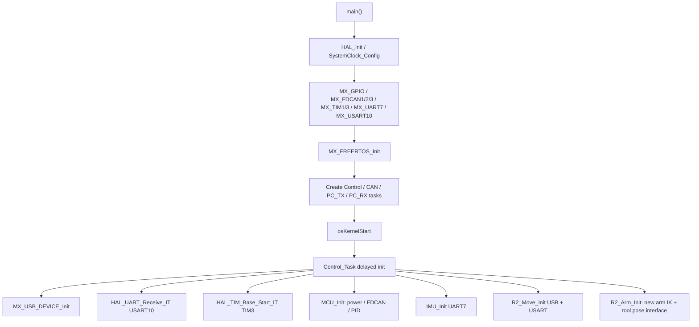
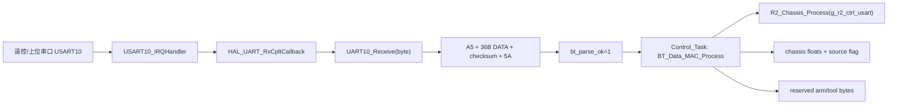
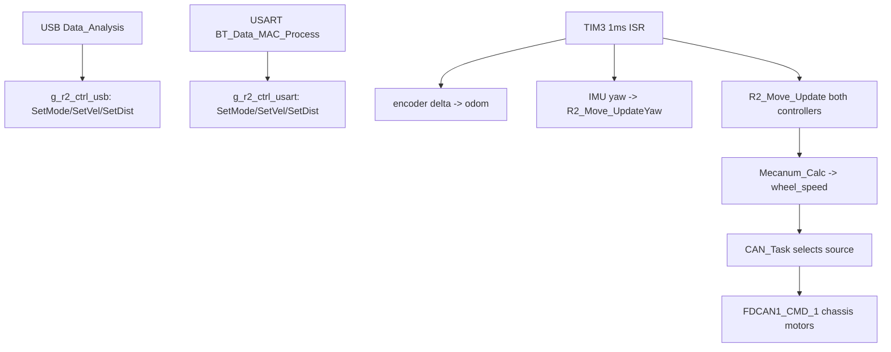
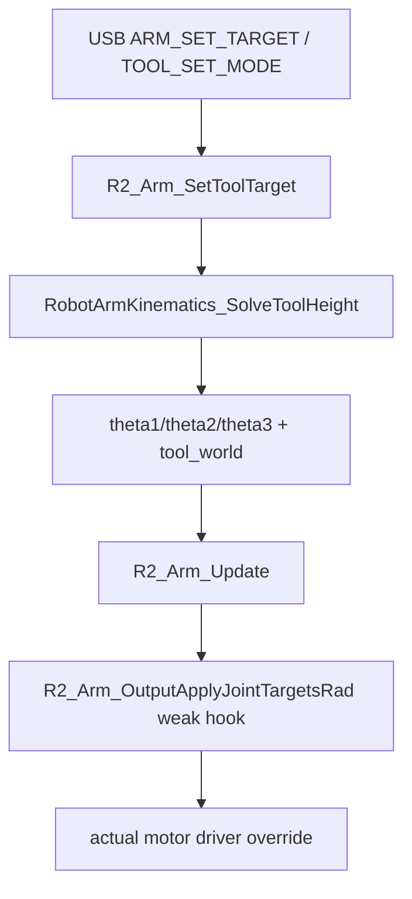

# STM32 FreeRTOS 工程阅读与问题检查报告

审计日期：2026-06-11  
工程路径：`F:\spareE\Vinci_Robocon_2026\26_RC_Projects\26_RC_02`  
目标芯片/工程：STM32H723VGTx，Keil AC6/CMSIS-Toolbox 工程

## 1. 总览

本工程是一个 STM32H723 + FreeRTOS + USB CDC + UART7/USART10 + FDCAN 的机器人控制工程。主业务集中在 `Applications`、`BSP`、`Components`、`USB_DEVICE` 四组目录；`Drivers` 和 `Middlewares` 主要是 ST HAL、CMSIS、FreeRTOS、USB Device Library 第三方/生成代码。

最近一次已有构建日志显示：

- `MDK-ARM/26_RC_02/26_RC_02.build_log.htm:115`：`0 Error(s), 0 Warning(s)`
- 程序大小：`Code=100952 RO-data=2072 RW-data=476 ZI-data=74172`

因此当前主要风险不是编译层面，而是运行时初始化、任务/中断并发、通信协议边界、底盘/机械臂/工具链路的行为一致性。

## 2. 工程文件清单与作用

### 2.1 Core

| 文件 | 作用 |
| --- | --- |
| `Core/Src/main.c` / `Core/Inc/main.h` | HAL 初始化、系统时钟、GPIO/FDCAN/TIM/UART 初始化、启动 FreeRTOS；`HAL_TIM_PeriodElapsedCallback()` 中 TIM2 做 HAL tick，TIM3 调用 `control_tim1mscallback()`。 |
| `Core/Src/freertos.c` / `Core/Inc/FreeRTOSConfig.h` | 创建 4 个静态线程：`Control_Task`、`CAN_Task`、`PC_TX_Task`、`PC_RX_Task`；提供弱定义任务函数。 |
| `Core/Src/fdcan.c` / `Core/Inc/fdcan.h` | CubeMX 生成的 FDCAN1/2/3 外设初始化、GPIO、NVIC、Message RAM 配置。 |
| `Core/Src/tim.c` / `Core/Inc/tim.h` | TIM1、TIM3 配置；TIM3 周期为 1ms，用于控制回调。 |
| `Core/Src/usart.c` / `Core/Inc/usart.h` | UART7、USART10 初始化；UART7 接 IMU，USART10 接遥控/机械臂回显。 |
| `Core/Src/gpio.c` / `Core/Inc/gpio.h` | GPIO 初始化，包含 H7 电源相关 GPIO。 |
| `Core/Src/stm32h7xx_it.c` / `Core/Inc/stm32h7xx_it.h` | 中断入口：FDCAN、TIM2/TIM3、USB OTG HS、UART7、USART10。 |
| `Core/Src/stm32h7xx_hal_timebase_tim.c` | 使用 TIM2 作为 HAL time base。 |
| `Core/Src/memorymap.c` / `Core/Inc/memorymap.h` | CubeMX 内存映射辅助。 |
| `Core/Src/system_stm32h7xx.c` | CMSIS 系统初始化和时钟更新。 |
| `Core/Src/stm32h7xx_hal_msp.c` | HAL MSP 基础初始化。 |

### 2.2 Applications

| 文件 | 作用 |
| --- | --- |
| `Applications/Task/Src/Control_Task.c` / `Inc/Control_Task.h` | 主控制任务；初始化 USB、UART10 接收、TIM3、FDCAN/PID、IMU、R2 底盘控制器、机械臂 IK、工具；USART 模式下周期运行遥控解析、工具状态机、麦轮和机械臂任务；提供 TIM3 1ms 控制回调。 |
| `Applications/Task/Src/CAN_Task.c` / `Inc/CAN_Task.h` | 1ms 周期下发 FDCAN1 底盘电机、FDCAN2 抬升电机、FDCAN3 机械臂电机命令；根据 `USART_Task_flag` / `USB_Task_flag` 选择控制源。 |
| `Applications/Task/Src/PC_RX_Task.c` / `Inc/PC_RX_Task.h` | 1ms 周期从 USB CDC 应用层 RX ring 读取字节，逐字节喂给 `Receive()` 帧解析状态机。 |
| `Applications/Task/Src/PC_TX_Task.c` / `Inc/PC_TX_Task.h` | 5ms 周期消费状态请求标志，回传系统、底盘、机械臂、工具状态。 |
| `Applications/Task/Src/INS_Task.c` / `Inc/INS_Task.h` | 当前基本空任务/占位，IMU 初始化已移至 `Control_Task`。 |
| `Applications/App_user/Src/R2_move.c` / `Inc/R2_move.h` | 新底盘运动控制器：8 种速度/位置模式、速度平滑、S 曲线位置规划、世界/机器人坐标转换、IMU yaw 闭环、麦轮解算。 |

### 2.3 BSP

| 文件 | 作用 |
| --- | --- |
| `BSP/Src/bsp_mcu.c` / `Inc/bsp_mcu.h` | 板级总初始化：H7 电源 GPIO、FDCAN filter/start、PID 初始化。 |
| `BSP/Src/bsp_fdcan.c` / `Inc/bsp_fdcan.h` | FDCAN filter 配置、启动、RX FIFO 回调，按电机反馈 ID 填充 `motor_fdcan1/2/3`。 |
| `BSP/Src/bsp_uart.c` / `Inc/bsp_uart.h` | HAL UART RX/TX/Error 回调：UART7 IMU 字节输入、USART10 遥控字节输入、机械臂 UART10 发送完成/错误处理。 |
| `BSP/Src/bsp_usb.c` / `Inc/bsp_usb.h` | USB 上位机协议帧收发：`A5 5A LEN CMD DATA CRC16 FF`；提供 `Send_Cmd_Data()` 与 `Receive()` 状态机。 |
| `BSP/Src/bsp_tick.c` / `Inc/bsp_tick.h` | 基于 HAL tick/TIM2 的阻塞式 us/ms 延时。 |
| `BSP/Inc/include.h` | 项目级公共 include 聚合。 |
| `BSP/Inc/struct_typedef.h` | 常用结构/类型定义。 |

### 2.4 Components/Algorithm

| 文件 | 作用 |
| --- | --- |
| `Data_Analysis.c/h` | USB 命令路由与解析：系统、底盘、机械臂、工具命令；固定按 4 个 little-endian float 解析。 |
| `CRC.c/h` | USART10 遥控协议解析，帧格式为 `A5 + 36B DATA + checksum + 5A`；生成 USART 通道底盘/机械臂/工具控制量。 |
| `mecanum_classic.c/h` | 麦克纳姆逆运动学：机器人速度 -> 四轮线速度；定义 `mecParam`、`total_vel`、`total_speed`。 |
| `chassis_move.c/h` | 旧/备用底盘位置控制和里程计模块；当前主链路主要使用 `R2_move`。 |
| `speedPlanner.c/h` | 速度斜坡平滑器，并且当前也实现了 `SCurve_*` 函数。 |
| `s_curve.c/h` | S 曲线接口/旧实现文件；当前 `.c` 文件内容基本为注释，实际实现位于 `speedPlanner.c`。 |
| `arm_ik_3r_safe_stm32h7.c/h` | 3R 机械臂逆解、正解、模型角/控制角转换、安全区判断。 |
| `arm_user.c/h` | 机械臂应用层：初始化 IK 参数、处理目标点、保存最近安全目标、输出电机角度目标、回传 IK 状态。 |
| `arm_echo_uart10.c/h` | USART10 机械臂状态回显打包与中断发送。 |
| `leg.c/h` | 腿部几何/解算相关函数，目前未进入主控制链路。 |

### 2.5 Components/Controller

| 文件 | 作用 |
| --- | --- |
| `pid.c/h` | 通用 PID，支持位置式/增量式，增加前馈系数 `Kf`。 |
| `pid_user.c/h` | FDCAN1/2/3 电机 PID 实例，底盘 yaw 角度/角速度 PID，提供电机速度/位置级联调用接口。 |

### 2.6 Components/Device

| 文件 | 作用 |
| --- | --- |
| `fdcan_receive.c/h` | DJI 电机反馈解析、累计角度、FDCAN 电流命令封包发送。 |
| `imu.c/h` | WitMotion IMU 初始化、UART7 单字节输入、SDK 回调更新加速度/陀螺仪/yaw。 |
| `wit_c_sdk.c/h` / `REG.h` | WitMotion 官方/移植 SDK 与寄存器定义。 |
| `robotarm_mixed.cpp/h` | FDCAN3 三电机通信封装，支持位置速度与 MIT 协议分发。 |

### 2.7 USB_DEVICE

| 文件 | 作用 |
| --- | --- |
| `USB_DEVICE/App/usb_device.c/h` | USB Device 初始化，注册 CDC class 和 CDC interface。 |
| `USB_DEVICE/App/usbd_cdc_if.c/h` | CDC interface；增加 RX/TX 应用层 ring buffer、`CDC_App_Read/Write/TxTask`。 |
| `USB_DEVICE/App/usbd_desc.c/h` | USB 描述符。 |
| `USB_DEVICE/Target/usbd_conf.c/h` | USB PCD 底层适配、FIFO 配置、LL API。 |

### 2.8 Drivers / Middlewares / MDK-ARM

| 目录 | 作用 |
| --- | --- |
| `Drivers/STM32H7xx_HAL_Driver` | ST HAL/LL 驱动。 |
| `Drivers/CMSIS` | CMSIS core/device 头文件。 |
| `Middlewares/Third_Party/FreeRTOS` | FreeRTOS 内核、CMSIS-RTOS v1 适配、heap_4、RVDS port。 |
| `Middlewares/ST/STM32_USB_Device_Library` | ST USB Device core 与 CDC class。 |
| `MDK-ARM` | Keil/CMSIS-Toolbox 工程、构建输出、map/log/hex/axf。 |

## 3. 模块关系与数据链路

### 3.1 初始化链路

### 3.2 FreeRTOS 任务

| 任务 | 创建位置 | 优先级 | 栈 | 主要行为 |
| --- | --- | --- | --- | --- |
| `Control_Task` | `Core/Src/freertos.c:120` | `osPriorityRealtime` | 2048 words | 初始化 USB/UART/TIM/FDCAN/PID/IMU/R2/IK/工具；循环处理 USART 遥控、工具、麦轮、机械臂。 |
| `CAN_Task` | `Core/Src/freertos.c:124` | `osPriorityHigh` | 2048 words | 1ms 下发 FDCAN1/2/3 电机命令。 |
| `PC_RX_Task` | `Core/Src/freertos.c:132` | `osPriorityAboveNormal` | 2048 words | 1ms 从 USB RX ring 取数据并调用 `Receive()`。 |
| `PC_TX_Task` | `Core/Src/freertos.c:128` | `osPriorityNormal` | 2048 words | 5ms 处理一次状态回传请求。 |

注意：`Control_Task.c` 中的强定义覆盖了 `freertos.c` 的 weak 默认任务。

### 3.3 USB 上位机链路

帧格式：

- RX/TX：`0xA5 0x5A LEN CMD DATA[LEN] CRC16_H CRC16_L 0xFF`
- CRC16：Modbus 多项式 `0xA001`，计算范围为帧头到数据区末尾，不含 CRC 和帧尾。
- `Data_Analysis.h` 注释约定上位机命令数据区固定 16 字节，即 4 个 little-endian float。

### 3.4 USART10 遥控链路

字段布局：

- `byte 0..7`：8 种底盘模式 one-hot。
- `byte 8`：`arm_flag`。
- `byte 9`：`UU_flag`，0=USART 源，1=USB 源。
- `byte 10..12`：保留；新机械臂工具目标通过 USB `ARM_SET_TARGET/TOOL_SET_MODE` 设置。
- `byte 13..15`：上/下台阶控制。
- `byte 16..27`：底盘参数。
- `byte 28..39`：保留给新机械臂控制链路；当前固件不从 USART 帧解析机械臂目标。

### 3.5 底盘控制链路

关键约定：

- 机器人坐标：`vx` 右为正，`vy` 前为正，`vw` CCW 为正。
- `Mecanum_Calc()` 内部对 `vw` 取负以匹配既有坐标系。
- `CAN_Task` 对 FR/BR 两个底盘电机命令取负，以适配安装方向。
- TIM3 ISR 同时更新 USB 与 USART 两套 R2 控制器。

### 3.6 机械臂与工具链路

新机械臂 IK 当前只解工具高度、工具使用/收纳姿态和底盘应用提供的 yaw；平面 `xy` 由底盘处理，实际电机输出通过弱符号接口留给驱动层覆盖。

## 4. 重点问题清单

### P0 - 高概率影响实际运行

1. **FDCAN2/FDCAN3 filter index 可能越界，运行时可能直接进入 `Error_Handler()`。**  
   `Core/Src/fdcan.c` 中 FDCAN1/2/3 的 `StdFiltersNbr` 都是 4；但 `BSP/Src/bsp_fdcan.c` 给 FDCAN2 使用 `FilterIndex = 7`，FDCAN3 使用 `FilterIndex = 14`。HAL 通常要求 `FilterIndex < StdFiltersNbr`。如果按 HAL 校验执行，`HAL_FDCAN_ConfigFilter()` 会失败，导致 `Error_Handler()`。  
   证据：`Core/Src/fdcan.c:58`、`Core/Src/fdcan.c:106`、`Core/Src/fdcan.c:154`；`BSP/Src/bsp_fdcan.c:63`、`BSP/Src/bsp_fdcan.c:80`。  
   建议：每个 FDCAN 实例先统一改为 `FilterIndex = 0` 验证，或同步增加对应实例的 `StdFiltersNbr` 并确认 H7 FDCAN Message RAM filter index 语义。

2. **USB 命令解析无长度校验，短帧合法 CRC 也会被按 16 字节解析。**  
   `Data_Analysis()` 忽略 `len`，直接调用 `USB_Read4Floats()` 读取 16 字节。`bsp_usb.Receive()` 支持任意 `LEN`，因此 `LEN < 16` 的合法 CRC 帧会读取本帧外/旧缓冲内容，导致模式、速度、机械臂坐标、源切换误动作。  
   证据：`Components/Algorithm/Src/Data_Analysis.c:48`、`Data_Analysis.c:54`、`Data_Analysis.c:168`；`BSP/Src/bsp_usb.c:299`。  
   建议：对需要 float payload 的命令强制 `len == 16`；GET_STATUS/STOP/ENABLE/DISABLE 可允许 `len == 0` 或 `16`，但不要无条件读 16 字节。

3. **新机械臂电机输出仍是弱符号留钩子，未绑定实际驱动。**  
   `R2_Arm_Update()` 已周期求解 `theta1/theta2/theta3`，但默认 `R2_Arm_OutputApplyJointTargetsRad()` 是 no-op。  
   建议：在实际电机驱动层覆盖该弱符号，将三关节目标角送入现有 FDCAN3 电机控制。

5. **控制器共享数据在 TIM3 ISR 与任务间并发读写，缺少同步。**  
   `Data_Analysis()`/`BT_Data_MAC_Process()` 在任务上下文调用 `R2_Move_SetMode/SetVel/SetDist()`；TIM3 ISR 同时调用 `R2_Move_UpdateOdom/UpdateYaw/Update()` 修改同一 `g_r2_ctrl_usb/usart`；`CAN_Task` 又读取 `wheel_speed` 下发。没有临界区、队列、双缓冲或任务通知，存在结构体字段撕裂和中间状态被读取的风险。  
   证据：`Components/Algorithm/Src/Data_Analysis.c:91`、`Data_Analysis.c:105`、`Data_Analysis.c:113`；`Components/Algorithm/Src/CRC.c:153`、`CRC.c:156`、`CRC.c:158`；`Applications/Task/Src/Control_Task.c:278`、`Control_Task.c:303`、`Control_Task.c:307`；`Applications/Task/Src/CAN_Task.c:42`、`CAN_Task.c:50`。  
   建议：将 1ms 控制更新移入高优先级任务，TIM3 ISR 只发通知；或对控制器输入/输出使用双缓冲与临界区。

### P1 - 明确风险，建议尽快修

6. **`USB_Task_flag` / `USART_Task_flag` 初值与注释不一致，且没有 `volatile`。**  
   代码把两者都初始化为 0，但注释写“上电默认 USART 源激活”。`CAN_Task` 和 TIM3 ISR 会读取这两个 flag；`Data_Analysis()` 与 `BT_Data_MAC_Process()` 会写它们。非 `volatile` + 多上下文访问会让优化和时序都变得不可靠。  
   证据：`Components/Algorithm/Src/CRC.c:24`、`CRC.c:25`；`Components/Algorithm/Inc/CRC.h:68`、`CRC.h:69`；`Applications/Task/Src/CAN_Task.c:42`、`CAN_Task.c:50`；`Applications/Task/Src/Control_Task.c:307`。  
   建议：明确上电默认源。如果默认安全停止，就改注释；如果默认 USART，则 `USART_Task_flag = 1U`。跨任务/ISR flag 至少声明为 `volatile`，更推荐集中到一个源状态枚举并加临界区。

7. **CAN 任务启动时使用阻塞式 `Delay_ms(5000)`，会在高优先级任务中忙等。**  
   `CAN_Task` 开头调用 `Delay_ms(5000)`，该延时是忙等 HAL tick，不会让出 CPU。CAN 任务优先级高于 PC_RX/PC_TX，可能在启动 5 秒内影响 USB 通信任务运行。  
   证据：`Applications/Task/Src/CAN_Task.c:18`；`BSP/Src/bsp_tick.c:55`。  
   建议：改为 `osDelay(5000)` 或在调度器启动前做硬件等待。

8. **FDCAN 与 PID 初始化重复执行。**  
   `MCU_Init()` 调用 `DJI_Moter_Init()` 后又调用 `PID_devices_Init()`；`DJI_Moter_Init()` 内部也调用 `PID_devices_Init()`。同时 `FDCANx_Filter_Init()` 内部已经 `FDCAN_Start()`，外层又 `HAL_FDCAN_Start()`。这可能导致重复 start、返回错误或状态不清。  
   证据：`BSP/Src/bsp_mcu.c:14`、`bsp_mcu.c:18`、`bsp_mcu.c:25`、`bsp_mcu.c:26`、`bsp_mcu.c:32`；`BSP/Src/bsp_fdcan.c:19`、`bsp_fdcan.c:59`。  
   建议：初始化函数保持单一职责：filter 函数只配置 filter，start 只调用一次；PID 初始化只调用一次。

9. **机械臂 USART10 回显模块没有完整接入。**  
   `ArmEchoUart10_Init()` 在 `Control_Task` 中被注释；`ArmEchoUart10_UpdateResult()` 未在 `arm_user.c` 中调用，状态缓存会保持默认值；`ArmIK_SendResultToUART10()` 仍是 TODO，不会发送 IK 结果简包。  
   证据：`Applications/Task/Src/Control_Task.c:91`、`Control_Task.c:179`；`Components/Algorithm/Src/arm_echo_uart10.c:83`、`arm_echo_uart10.c:90`；`Components/Algorithm/Src/arm_user.c:74`、`arm_user.c:81`、`arm_user.c:314`。  
   建议：恢复 `ArmEchoUart10_Init()`；在 `ArmIK_SendResultToAll()` 或各结果分支调用 `ArmEchoUart10_UpdateResult()`；补齐 UART10 简包发送接口或删除 TODO 路径避免误判。

10. **TIM3 ISR 中执行较重浮点控制逻辑。**  
    TIM3 1ms 回调内读取编码器、做里程计、IMU yaw 修正、更新两套 R2 控制器，并可能涉及三角函数、S 曲线、PID、麦轮解算。该 ISR 与 FreeRTOS 同优先级边界较敏感，且执行时间不可忽略。  
    证据：`Core/Src/main.c:244`；`Applications/Task/Src/Control_Task.c:237`、`Control_Task.c:278`、`Control_Task.c:298`、`Control_Task.c:303`。  
    建议：TIM3 ISR 只递增 tick 或释放 task notification，由实时控制任务执行浮点控制。

11. **USB CDC TX ring 多上下文写入缺少互斥。**  
    `CDC_App_Write()` 可被 `PC_TX_Task`、`ArmIK_SendResultToUSB()` 等路径调用；TX 完成回调同时推进 `s_txR/s_txInflight`。当前只用 `volatile`，没有互斥或临界区。  
    证据：`USB_DEVICE/App/usbd_cdc_if.c:637`、`usbd_cdc_if.c:656`、`usbd_cdc_if.c:553`；`Components/Algorithm/Src/arm_user.c:55`。  
    建议：TX ring 写入和 `s_txInflight/s_txR` 更新用短临界区或单一 USB TX 任务串行化。

12. **底盘轮序/正负号存在两套描述，需要硬件复核。**  
    `CAN_Task` 注释与实现采用 FDCAN1 Motor1=FR、2=BR、3=BL、4=FL，且 FR/BR 命令取负；`control_tim1mscallback()` 里程计公式也内嵌了 FR/BR 安装反向假设。旧 `chassis_move.c` 的 `wheel_sign` 却全为 1，注释也与实现不一致。当前主链路用 `R2_move`，但建议用实车测试逐轮正转验证。  
    证据：`Applications/Task/Src/CAN_Task.c:42`、`CAN_Task.c:44`、`CAN_Task.c:52`；`Applications/Task/Src/Control_Task.c:278`；`Components/Algorithm/Src/chassis_move.c:10`。  
    建议：建立一张“物理轮位 -> CAN ID -> 正向电流 -> 编码器增量 -> 软件 wheel 字段”的标定表。

### P2 - 清理/一致性问题

13. **`s_curve.c` 只剩注释实现，真实 `SCurve_*` 在 `speedPlanner.c`。**  
    这不会导致编译错误，但维护者容易误读。建议保留一个实现位置，另一个文件删除或只作为 wrapper。

14. **`INS_Task` 为空，任务未创建。**  
    IMU 初始化与数据更新已经由 `Control_Task` + UART7 中断完成，`INS_Task` 当前可删除或补充为 IMU 数据处理任务。

15. **中文注释编码混乱。**  
    多数文件显示为乱码，后续维护和代码审查成本高。建议统一为 UTF-8，并确保 Keil/编辑器编码一致。

## 5. 分模块检查结论

### 5.1 FreeRTOS 任务

- 任务创建配置清楚，栈均为 2048 words，优先级从高到低为 Control > CAN > PC_RX > PC_TX。
- `Control_Task` 是实际初始化中枢，开头 `osDelay(5000)` 会让出 CPU；`CAN_Task` 开头 `Delay_ms(5000)` 不让出 CPU，应改。
- `PC_RX_Task` 只负责 USB ring -> 帧解析，职责清楚。
- `PC_TX_Task` 每次只处理一个状态请求，能限制突发回传，但请求 flag 是普通 `volatile uint8_t`，没有计数，多次同类请求会合并。
- 最大设计问题是大量控制状态在任务和 ISR 间直接共享，没有统一消息队列/锁/双缓冲。

### 5.2 USB 通信链路

优点：

- CDC RX/TX 已从 CubeMX 默认单包模式扩展为应用层 ring buffer。
- 协议有帧头、长度、命令、CRC16、帧尾，`Receive()` 有基本重同步逻辑。
- TX 有丢帧统计 `USB_GetSendDropFrames()`。

问题：

- `Data_Analysis()` 对 `len` 不做校验是最明确的协议 bug。
- USB 命令文档写固定 16 字节 payload，但 `Receive()` 接受任意长度，协议层和业务层边界不一致。
- CDC TX ring 可能被多任务/回调并发访问。
- `CDC_App_TxTask()` 只在写入和 TX complete 时推进；如果 `USBD_CDC_TransmitPacket()` 因 busy 失败，没有周期性补偿调用，虽然下一次写入/完成可能恢复，但建议 PC_TX 或专门 USB TX 任务周期调用。

### 5.3 USART10 数据解析

优点：

- 固定长度状态机简单清晰；checksum 为 36 字节数据区低 8 位和。
- `BT_Data_MAC_Process()` 用短临界区复制完整帧再解析，避免解析过程中 ISR 改写。

问题：

- `bt_data` 与 `bt_parse_ok` 只支持单帧缓存；若遥控帧速率高于 `Control_Task` 消费速率，会覆盖最新帧，旧帧丢失。对遥控通常可接受，但应在文档中标明“保留最新帧”。
- 源切换 flag 普通全局变量，被多个上下文读取。
- checksum 失败只更新 `crc_dbg.checksum_ok=0`，尾字节错误不会记录更具体错误；调试能力有限。

### 5.4 底盘运动

优点：

- 新 `R2_move` 设计完整，支持 8 模式、速度平滑、位置 S 曲线、世界/机器人坐标转换和 IMU yaw 闭环。
- TIM3 1ms 同时更新 USB/USART 两套控制器，CAN 任务按源选择输出，整体链路完整。
- 状态回传包含模式、位置状态、速度、里程计、误差等字段，便于上位机闭环观察。

风险：

- R2 控制器跨 ISR/任务并发访问，是底盘最主要风险。
- 轮序/正负号需要实车逐轮验证，尤其 FR/BR 取负和里程计公式是否同时匹配。
- `mecParam.max_wheel_speed = 0.68f` 与注释中 9000 rpm/3.68m/s 类描述不一致，需要按真实电机/轮径/减速比确认。
- `R2_Move_UpdateOdom()` 先在外部用 IMU yaw 更新，再内部叠加 `delta_yaw`，随后又被下一步 `R2_Move_UpdateYaw()` 覆盖为 IMU yaw。当前位置积分使用的是更新前 yaw 还是 IMU yaw，需要按预期确认。

### 5.5 机械臂

优点：

- IK 层接口清楚：模型角、几何控制角、电机方向控制角分离。
- 不可达/不安全时保持上一次安全目标，避免目标突变。
- USB 状态回传包含目标、模型角、电机目标、实际编码器角。

问题：

- UART10 回显状态链路未完整接入。
- USB 目标解析在 `Data_Analysis()` 中只在收到目标帧时调用 `Arm_task_USB()`；如果需要持续保持/周期更新，当前不是周期性 USB 机械臂任务。
- `Arm_task()` 仅在 USART 源分支运行，因此 USB 源下不会执行 `ArmEchoUart10_StartSend_IT()`。
- J1 只在 CAN 输出前做 `AngleClamp60()`，状态层仍可能显示超出 60 deg 的目标；建议在目标生成或状态回传中统一约束语义。

### 5.6 新机械臂工具坐标

当前工具层只保留三工具位姿接口：`S1/S2/gripper`、`stow/use`、目标高度和 yaw。工具末端坐标相对 joint4 固定，实际工具本体动作不在此链路内处理。

## 6. 建议修复顺序

1. 修 FDCAN filter index 和重复 start，保证三路 FDCAN 能稳定启动。
2. 修 USB `len` 校验，避免异常帧造成误动作。
3. 把 TIM3 ISR 改成通知控制任务，统一处理 R2 控制器读写，或者至少给共享结构加临界区/双缓冲。
4. 明确默认控制源，并将源 flag 改成 `volatile` 或集中状态机。
5. 覆盖 `R2_Arm_OutputApplyJointTargetsRad()`，把 IK 输出接入实际 FDCAN3 电机驱动。
6. 清理机械臂 UART10 回显：初始化、状态缓存更新、TODO 发送路径。
7. 做实车逐轮验证：底盘四轮方向、编码器增量、FDCAN ID、里程计正方向。
8. 统一注释编码为 UTF-8。

## 7. 验证用例

### 7.1 静态验证

- 确认 `FDCANx_Filter_Init()` 中每个 `FilterIndex` 满足 HAL 要求。
- 搜索所有 `USB_Task_flag` / `USART_Task_flag` 读写点，确认类型和同步策略一致。
- 搜索所有 `g_r2_ctrl_usb/usart` 写入点，确认不会与控制更新并发。
- 搜索 `CDC_App_Write()` 调用点，确认 TX ring 写入串行化。

### 7.2 USB 协议用例

- 合法 16 字节命令帧：`A5 5A 10 CMD DATA[16] CRC FF`，应进入对应命令。
- `LEN=0` 的 GET_STATUS/STOP/ENABLE/DISABLE：按设计决定是否接受；不得读取 16 字节。
- `LEN<16` 且 CRC 正确的 SET_VEL/SET_TARGET：必须拒绝，不得改控制量。
- CRC 错误、尾字节错误、连续帧、帧中嵌套 `A5`：状态机应能复位/重同步。
- TX ring 满：`USB_GetSendDropFrames()` 应增加，系统不应阻塞。

### 7.3 USART10 协议用例

- 合法帧：`A5 + 36B + checksum + 5A`，`crc_dbg.frame_count` 增加。
- checksum 错误：不更新控制量，`checksum_ok=0`。
- 尾字节错误：状态机回到 WAIT_HEADER。
- `UU_flag` 0/1 切换：CAN 输出源、工具源、状态回传一致。
- 8 个模式位全 0：底盘应停；多个模式位同时为 1：当前选择最小索引，应确认是否符合协议。

### 7.4 底盘实车验证

- 单独给 FDCAN1 Motor1/2/3/4 小电流，记录轮位和正转方向。
- 手推每个轮子，记录 `motor_fdcan1[i].total_angle` 正负。
- 命令 `vx>0`、`vy>0`、`vw>0`，确认实际右移/前进/逆时针。
- 位置模式小位移：检查 `pos_err_x/y/yaw` 是否收敛。
- IMU yaw 正方向：手动旋转底盘，确认 yaw PID 是负反馈。

### 7.5 机械臂/工具验证

- 机械臂输入可达点，确认 `active_motor_deg` 和 FDCAN3 目标方向一致。
- 输入不可达/不安全点，确认保持上一次安全目标。
- J1 超过 60 deg 的目标，确认 CAN 输出限幅且状态显示符合预期。
- 工具 open/close 命令，确认目标角、CAN 输出、真实角、状态机 run_status 全链路变化。
